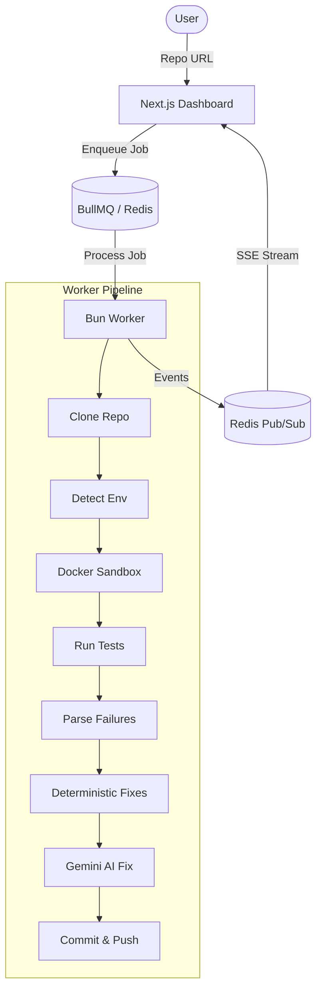

<!-- @format -->

# RIFT 2026: Autonomous CI/CD Healing Agent

An autonomous DevOps agent built for the **RIFT 2026 Hackathon AI/ML Track**. This system detects, fixes, and verifies code issues in GitHub repositories through a deterministic pipeline and localized AI logic repair.

---

## 🏗️ Architecture

The system follows a monorepo architecture with a clear separation between the reactive frontend dashboard and the heavyweight worker pipeline, communicating via **BullMQ** and **Redis SSE Streams**.



---

## 🚀 Features

- **Autonomous Recovery:** Automatically identifies and repairs common CI/CD failures (Linting, Syntax, Logic).
- **Multi-Stage Pipeline:** Follows a structured recovery lifecycle from `INIT` to `FINISH`.
- **Sandboxed execution:** All user code is executed inside isolated Docker containers (Python 3.11).
- **Deterministic-First Fixing:** Prioritizes industry-standard tools (Black, Autopep8) before falling back to Large Language Models.
- **Live Dashboard:** Real-time visibility into the agent's actions, logs, and scoring breakdown.
- **Automated Git Workflow:** Creates dedicated branches, commits fixes with `[AI-AGENT]` prefix, and pushes back to GitHub.

---

## 🛠️ Tech Stack

### Frontend & API

- **Framework:** [Next.js 16](https://nextjs.org/) (App Router)
- **State Management:** [Zustand](https://github.com/pmndrs/zustand)
- **Deployment:** [Vercel](https://vercel.com/)
- **Real-time:** Server-Sent Events (SSE) via Next.js Route Handlers
- **UI:** Tailwind CSS, Shadcn UI, Radix UI

### Worker & Backend

- **Runtime:** [Bun](https://bun.sh)
- **Orchestration:** [BullMQ](https://docs.bullmq.io/) & [Redis](https://redis.io/)
- **Sandbox:** [Docker](https://www.docker.com/) (Python 3.11 Slim)
- **AI:** [Google Gemini 1.5 Pro](https://ai.google.dev/) via `@google/generative-ai`
- **Git:** `simple-git` & Git CLI

---

## 📂 Monorepo Structure

- [apps/frontend](apps/frontend): The Next.js dashboard and SSE API handlers.
- [apps/worker](apps/worker): The core Bun worker and pipeline orchestrator.
- [packages/fixes](packages/fixes): Deterministic fix engine (formatting, imports, basic syntax).
- [packages/parser](packages/parser): Sophisticated failure parsing for Pytest and Flake8.
- [packages/llm](packages/llm): Wrapper for Gemini API logic repair.
- [packages/docker](packages/docker): Docker container management and command execution.
- [packages/git](packages/git): Utility for automated branch creation and commits.

---

## ⚙️ Installation & Setup

### Prerequisites

- [Bun](https://bun.sh) installed.
- [Docker](https://www.docker.com/) Desktop or Engine.
- [Redis](https://redis.io/) instance (local or managed).

### 1. Clone & Install

```bash
git clone https://github.com/your-org/rift26-ops.git
cd rift26-ops
bun install
```

### 2. Environment Variables

Create a `.env` file in the root directory (or specific apps):

| Variable              | Description                                           |
| :-------------------- | :---------------------------------------------------- |
| `REDIS_URL`           | Redis connection URL (e.g., `redis://localhost:6379`) |
| `GITHUB_TOKEN`        | Personal Access Token for cloning and pushing         |
| `GEMINI_API_KEY`      | Google AI Studio API key for logic repair             |
| `NEXT_PUBLIC_APP_URL` | Base URL for the frontend                             |

### 3. Run the System

```bash
# Start the frontend
bun run web

# Start the worker
bun run worker
```

---

## 🐞 Supported Bug Types

Our agent is trained to handle the following failures autonomously:

- **LINTING:** Unused imports, trailing whitespace, line length.
- **SYNTAX:** Missing colons, bracket mismatches, indentation errors.
- **LOGIC:** Buggy algorithmic logic (via AI repair).
- **TYPE_ERROR:** Mismatched types in Python annotations.
- **IMPORT:** Missing or circular dependencies.
- **INDENTATION:** mixed tabs/spaces and inconsistent indentation.

---

## 📊 Scoring System

The agent provides a final score based on its efficiency:

- **Base:** 100 Points.
- **Speed Bonus:** +10 Points if the entire run takes < 5 minutes.
- **Efficiency Penalty:** -2 Points for every commit over the 20-commit threshold.

---

## 👥 Team Members

- **[Your Name]** - Lead Engineer / Agent Architecture
- **[Team Member 2]** - Frontend & Dashboard

---

## ⚠️ Known Limitations

- **Language Support:** Currently supports Python repositories ONLY.
- **Complexity:** Deep architectural refactoring is out of scope for the current MVP.
- **Docker:** Requires Docker to be running on the host machine where the worker is deployed.

---

_Built for RIFT 2026. Automated DevOps is the future._
